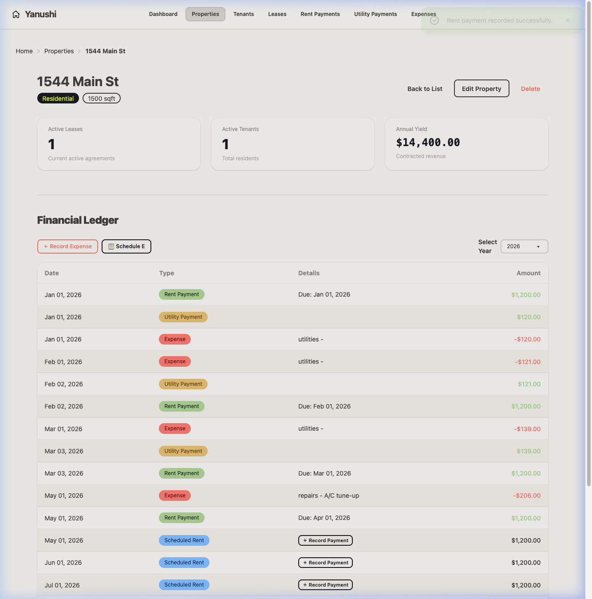

# Yanushi

Yanushi is a property management application designed for landlords who value simplicity and visual excellence. Built with **Ruby on Rails 8** and styled with **Tailwind CSS** and **daisyUI**, Yanushi provides a streamlined experience for managing rental properties, tenants, and finances.


## Core Features

- **🏠 Property Portfolio**: Manage all your rental properties in one place with detailed occupancy and financial summaries.
- **👥 Tenant & Lease Management**: Track active leases, tenant contact information, and automated rent schedules.
- **📊 Unified Financial Ledger**: A centralized view of all property-related transactions, including scheduled rents, payments, utility bills, and maintenance expenses.
- **💰 Rent Collection**: Effortlessly record and track rent payments with support for transaction reference numbers (Zelle, Venmo, etc.).
- **📑 Tax Reporting**: Generate year-filtered summaries designed to make filing **Schedule E** of Form 1040 simple and stress-free.

---

## Usage Example: Recording a Rent Payment

Yanushi makes tracking financial health intuitive through its property ledger view. Here is how you can record a rent payment:

### 1. The Financial Ledger
Navigate to any property to see its **Financial Ledger**. Here, you can see all **Scheduled Rents** for the year. Overdue rents are clearly marked.


### 2. Record a Payment
Click the **"Record Payment"** button next to any scheduled rent. A modal will appear, allowing you to enter the payment date, amount, and a transaction reference (like a Zelle transaction number).


### 3. Updated Status
Once saved, the ledger updates instantly. The "Scheduled Rent" is converted into a confirmed **Rent Payment**, and your property's financial totals are recalculated in real-time.



---

## Getting Started

### Prerequisites

- Ruby 3.3.0+
- Rails 8.0+
- SQLite3

### Installation

1. Clone the repository:
   ```bash
   git clone https://github.com/chongfun/yanushi.git
   cd yanushi
   ```

2. Install dependencies:
   ```bash
   bundle install
   ```

3. Setup the database:
   ```bash
   bin/rails db:prepare
   ```

4. Start the development server:
   ```bash
   bin/dev
   ```

Visit `http://localhost:3000` to start managing your properties.
