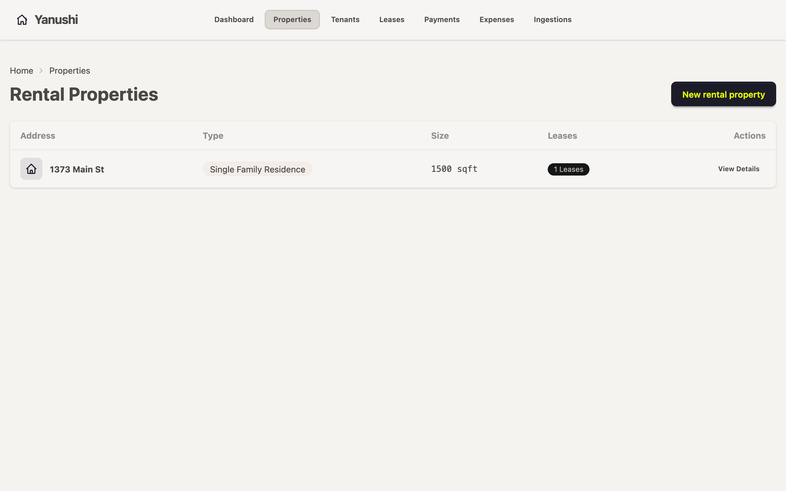
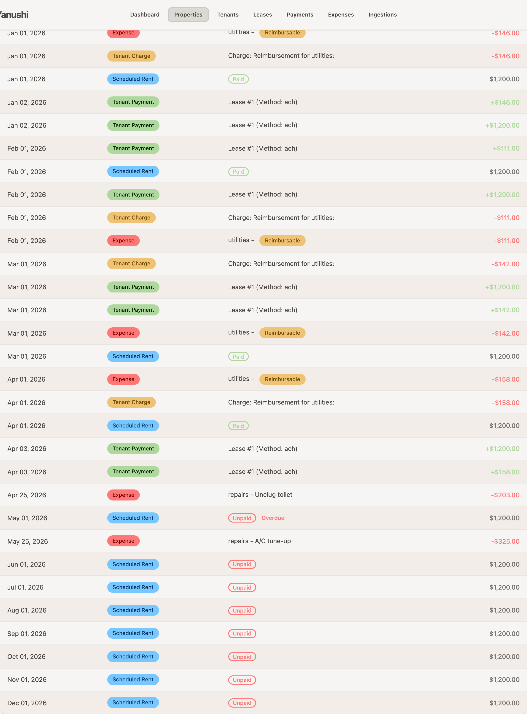
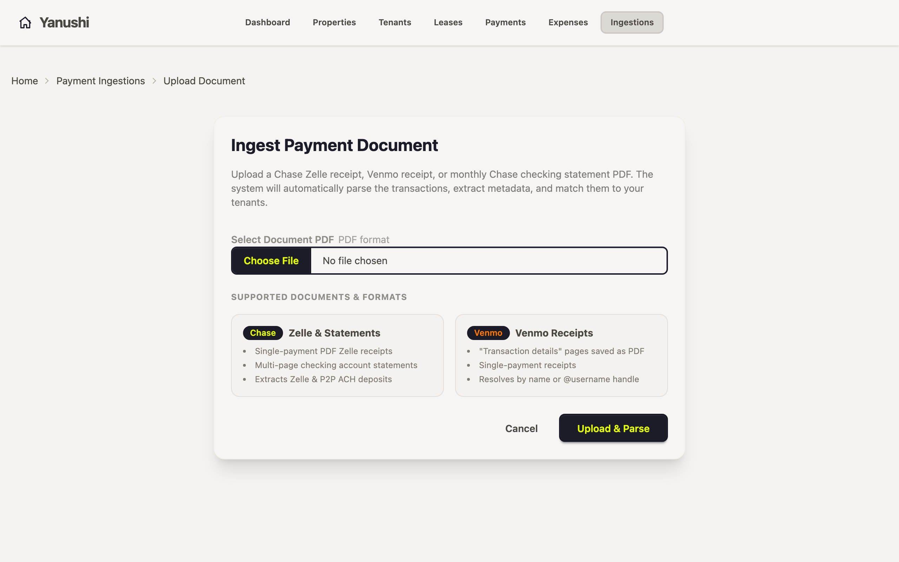
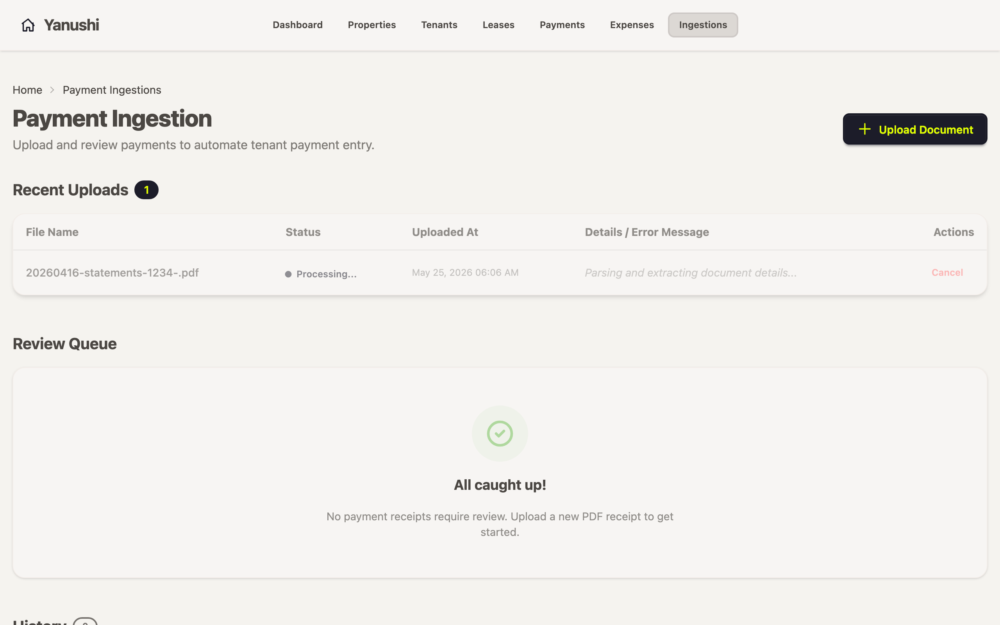
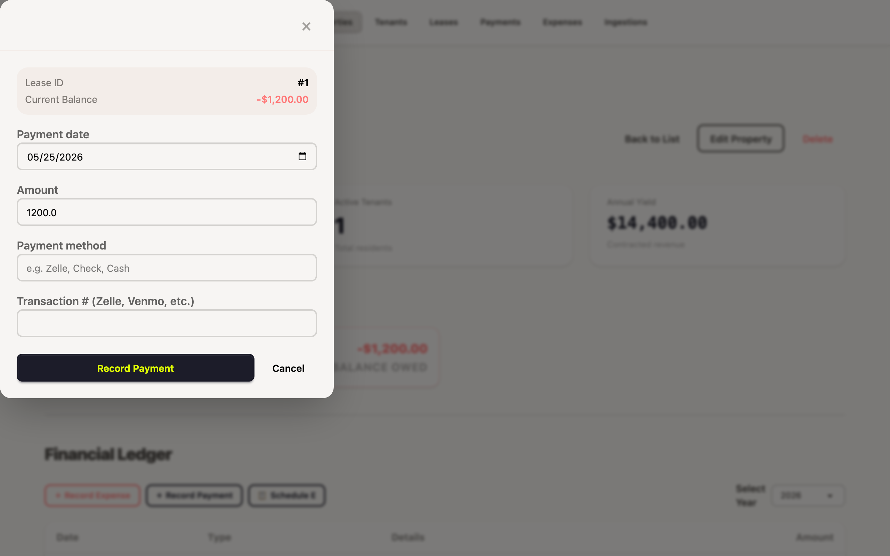

# Yanushi

Yanushi is a property management application designed for landlords who value simplicity and visual excellence. Built with **Ruby on Rails 8** and styled with **Tailwind CSS** and **daisyUI**, Yanushi provides a streamlined experience for managing rental properties, tenants, and finances.



## Core Features

- **🏠 Property Portfolio**: Manage all your rental properties in one place with detailed occupancy and financial summaries.
- **👥 Tenant & Lease Management**: Track active leases, tenant contact information, and automated rent schedules.
- **📊 Unified Financial Ledger**: A centralized view of all property-related transactions, including scheduled rents, payments, utility bills, and maintenance expenses.
- **💸 Automated Document Ingestion**: Upload Chase bank statements or Venmo receipts, and Yanushi will automatically parse, extract, and match payments to your tenants.
- **📑 Tax Reporting**: Generate year-filtered summaries designed to make filing **Schedule E** of Form 1040 simple and stress-free.

---

## The Financial Ledger

The property ledger provides a unified view of all financial activities, automatically categorizing and color-coding items for quick scanning:

- **Scheduled Rent** (Blue): Expected rent payments automatically generated based on the active lease terms. Indicates if a rent is Paid, Unpaid, or Overdue.
- **Tenant Payment** (Green): Confirmed payments received from tenants. Automatically zeroes out the corresponding scheduled rent and contributes to the property's income.
- **Expense** (Red): Property maintenance costs, repairs, or utility bills. Reimbursable expenses are clearly tagged.
- **Tenant Charge** (Yellow): Any charges passed onto the tenant (e.g. late fees, utility reimbursements).



---

## Usage Example: Automating Rent Collection

Yanushi eliminates manual data entry by automatically parsing bank statements and payment receipts.

### 1. Upload a Document
Navigate to the **Payment Ingestions** page and upload a supported document, such as a Chase checking account statement or a Venmo receipt.



### 2. Review Queue
Once uploaded, Yanushi extracts the transactions and automatically matches them to your active leases based on payer name, tenant name, or rent amount. You can review and confirm these matches in the Review Queue.



### 3. The Financial Ledger
Once confirmed, the payments instantly appear in your property's **Financial Ledger**. Overdue scheduled rents are automatically resolved and your property's financial totals are recalculated in real-time.


## Usage Example: Manual Payment Recording

While automated ingestion is recommended, you can also record payments manually if a tenant pays with cash or an unsupported method.

### 1. Record a Payment
From the property ledger, click the **"Record Payment"** button next to any scheduled rent. A modal will appear, allowing you to enter the payment date, amount, and a transaction reference.



---

## Getting Started

### Prerequisites

- Ruby 3.3.0+
- Rails 8.0+
- PostgreSQL 10+ (any version that supports SELECT FOR UPDATE SKIP LOCKED for job processing)

### Installation

1. Clone the repository:
   ```bash
   git clone https://github.com/chongfun/yanushi.git
   cd yanushi
   ```

2. Install dependencies:
   ```bash
   bundle install
   ```

3. Setup the database:
   ```bash
   bin/rails db:prepare
   ```

4. Start the development server:
   ```bash
   bin/dev
   ```

Visit `http://localhost:3000` to start managing your properties.
