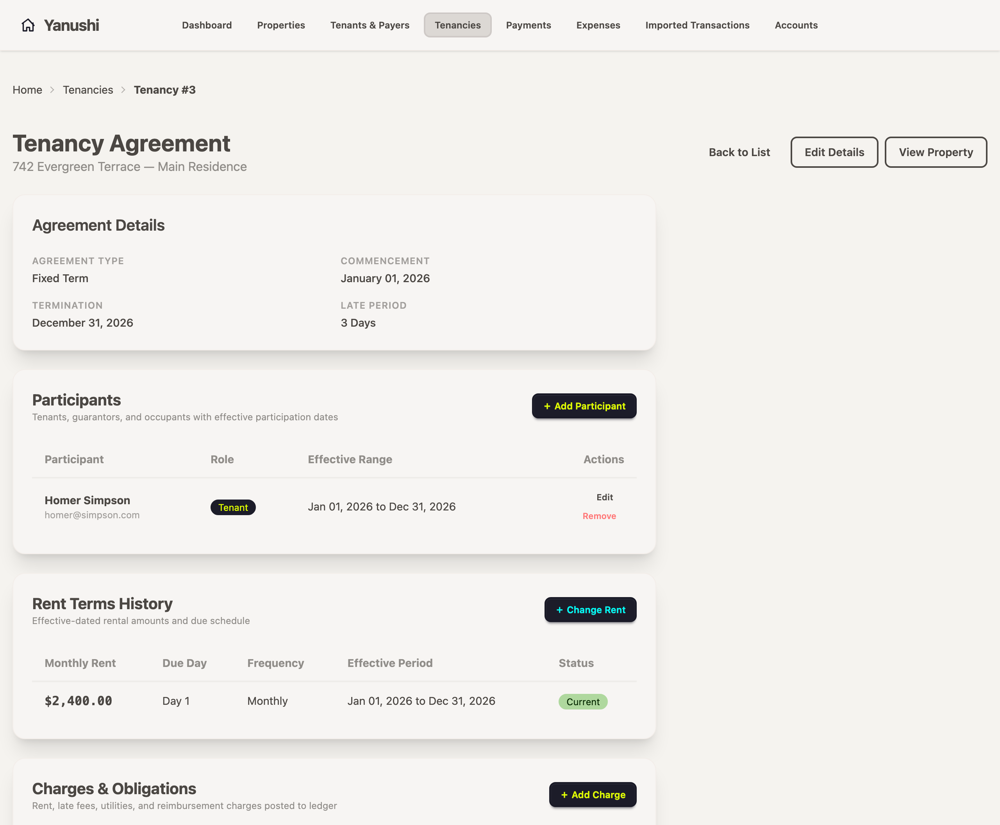
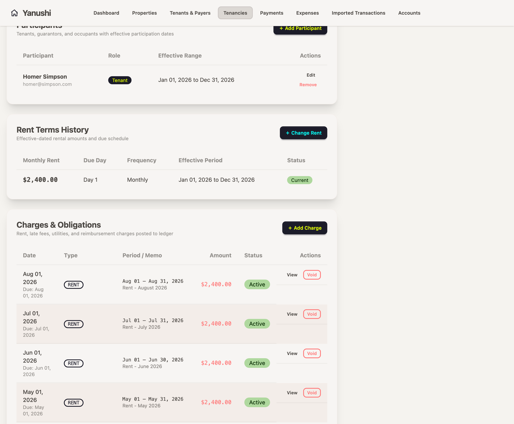
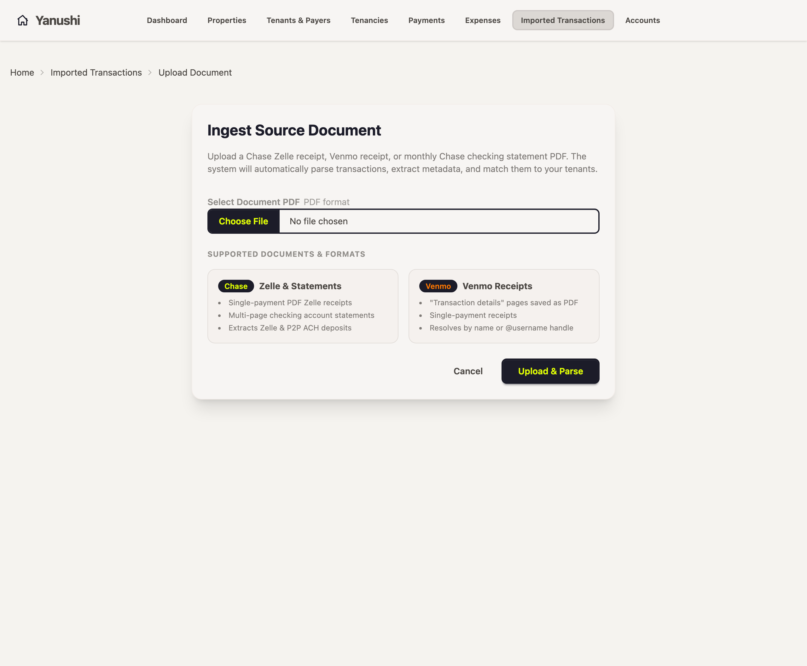
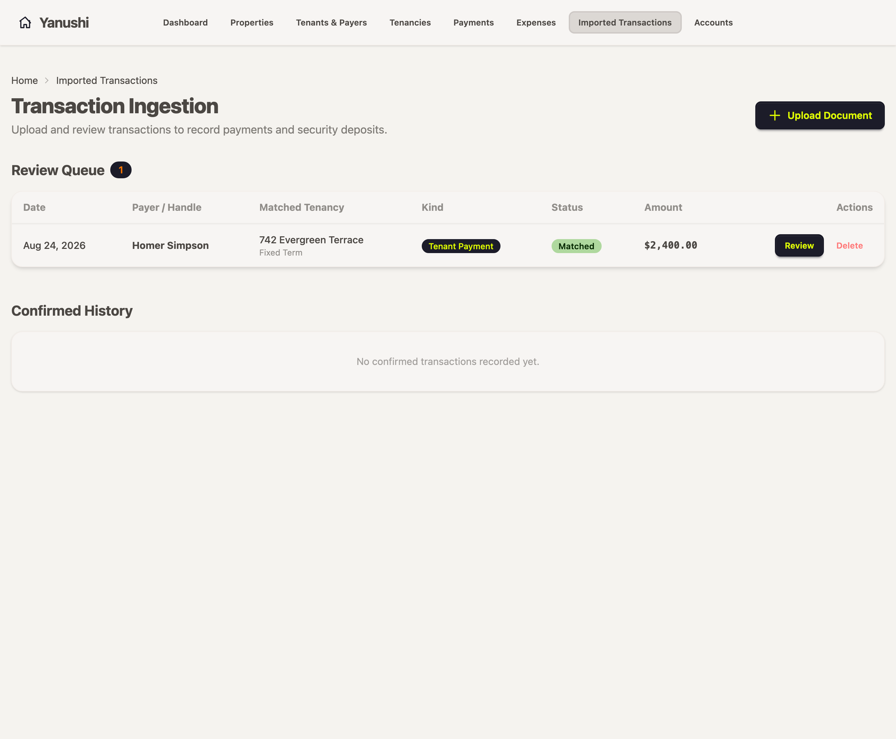
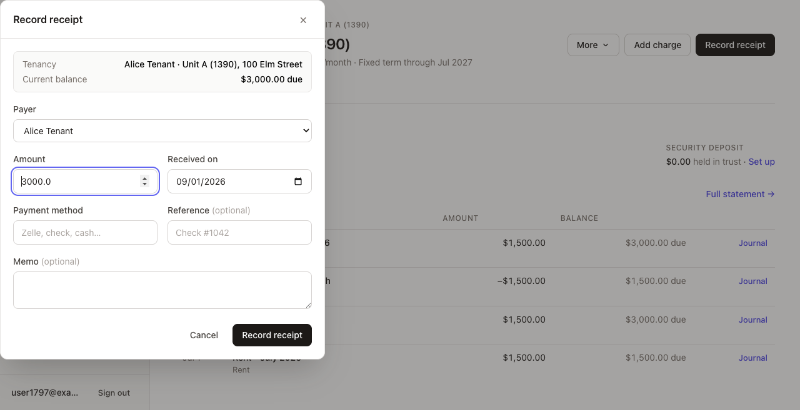
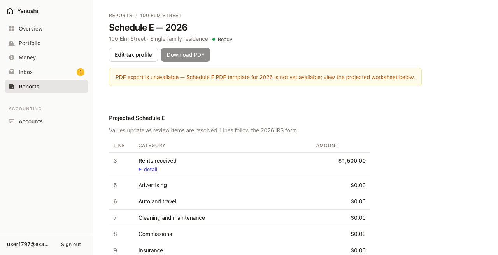

# Yanushi

Yanushi is a modern, double-entry property management and tax reporting platform designed for landlords and property managers who value precision, auditability, and simplicity. Built with **Ruby on Rails 8**, **PostgreSQL**, **Hotwire (Turbo + Stimulus)**, and custom **Yanushi UI** design tokens on Tailwind CSS, Yanushi provides an immutable ledger foundation for managing rental properties, tenancies, automated ingestion, and tax compliance.

---

## Application Structure & Navigation

Yanushi organizes property management into 5 primary top-level areas and a secondary accounting administration section:

- **📊 Overview (`/`)**: High-level dashboard highlighting portfolio occupancy, monthly cash collections, pending reviews, and quick action shortcuts.
- **🏠 Portfolio (`/portfolio`)**: Multi-unit and single-family property management with unit-level tracking, tenancy agreements, co-tenants, and tenant directories.
- **💳 Money (`/money`)**: Centralized financial activity hub covering cash receipts, operating expenses, tenant charges, and running balances.
- **📥 Inbox (`/inbox`)**: Automated source document ingestion for bank statements and digital receipts with live Action Cable status broadcasts, smart matching, and review queues.
- **📑 Reports (`/reports`)**: Tax year readiness tracking and IRS Schedule E tax worksheets, review resolution workflows, and PDF exports.
- **📒 Accounting (`/accounts`)**: Secondary administrative section for managing the chart of accounts and inspecting double-entry journal postings.

---

## Core Features

- **🏠 Property Portfolio**: Manage multi-unit and single-family properties with unit-level tracking, occupancy status, and property-scoped financial reporting.
- **👥 Parties & Tenancies**: Track tenant parties, flexible tenancy agreements (fixed-term and periodic), versioned rent terms, and multiple co-tenants per tenancy.
- **📒 Immutable Double-Entry Ledger**: Every financial event (rent charge, fee, receipt, expense, security deposit) posts balanced debit and credit entries to a 100% auditable general ledger.
- **💳 Tenancy Running Accounts**: Dynamic ledger-backed tenant balances eliminating fragile direct-payment linking. Easily generate rent charges, assess late fees, bill utility reimbursements, and record multi-payer receipts.
- **🛡️ Security Deposit Custody**: Separate trust liability accounting for security deposits with dedicated custody tracking, refunds, and charge settlements.
- **📄 Automated Source Document Ingestion**: Upload bank statements (e.g. Chase) and digital receipts (Venmo, Zelle). Yanushi automatically parses transactions, deduplicates documents via SHA-256, and provides an interactive confirmation queue.
- **📑 IRS Schedule E Tax Reporting**: Generate Schedule E tax worksheets and PDFs with property classifications (Codes 1–5, 7–8), cash-basis rental income calculation (Line 3), standardized expense categorization, review resolution workflows, and PDF export with Line 19 itemized statements.

---

## Architecture Highlights

```
+-----------------------------------------------------------------------------------+
|                                DOMAIN LAYER                                       |
|  Property | RentableUnit | Party | Tenancy | RentTerm | Charge | Receipt | Expense  |
|  SecurityDeposit | SourceDocument | ImportedTransaction                           |
+-----------------------------------------------------------------------------------+
                                         |
                                         v
+-----------------------------------------------------------------------------------+
|                              ACCOUNTING LAYER                                     |
|  Accounting::PostEntryService | Accounting::PostingBuilder | ReverseEntryService  |
|  - Balanced double-entry postings (Debits > 0, Credits < 0, Sum = 0)             |
|  - Idempotent source-event dispatch: (user_id, source_type, source_id, event_type)|
+-----------------------------------------------------------------------------------+
                                         |
                                         v
+-----------------------------------------------------------------------------------+
|                         IMMUTABLE LEDGER STORAGE                                  |
|  Account | JournalEntry | Posting                                                 |
+-----------------------------------------------------------------------------------+
```

See [Double-Entry Accounting Architecture](documentation/accounting_architecture.md) for detailed technical specifications, posting rules, and extension guidelines.

---

## Visual Workflows & Usage Examples

### 1. Tenancy Running Accounts & Activity Ledger
Tenancy accounts maintain dynamic, double-entry ledger-backed running balances. Scheduled rent charges, receipts, and billed reimbursements drive the tenancy account, while property and maintenance expenses post separately to the property ledger.





---

### 2. Automated Document Ingestion & Confirmation Queue
Upload bank checking statements (e.g. Chase) or digital receipts (Venmo, Zelle). Yanushi parses transaction metadata, deduplicates files via SHA-256, and matches payments directly to active tenancies.





---

### 3. Direct Receipt & Payment Recording
Record manual receipts for cash, checks, or direct transfers. Payments immediately debit operating Cash and credit Tenant Receivable on the double-entry ledger.



---

### 4. Schedule E Tax Worksheet & Reporting
Generate property-level Schedule E tax worksheets with IRS classifications (Codes 1–5, 7–8), cash-basis rental income calculation (Line 3), standardized expense categorization, review resolution workflows, and PDF export.



---

## Getting Started

### Prerequisites

- Ruby 4.0+
- Rails 8.1+
- PostgreSQL 14+ (with `pg_catalog.plpgsql`)

### Installation & Setup

1. Clone the repository:
   ```bash
   git clone https://github.com/chongfun/yanushi.git
   cd yanushi
   ```

2. Install dependencies:
   ```bash
   bundle install
   ```

3. Setup database and load schema:
   ```bash
   bin/rails db:prepare
   ```

4. Run the seed data (optional):
   ```bash
   bin/rails db:seed
   ```

5. Start the development server:
   ```bash
   bin/dev
   ```

Visit `http://localhost:3000` to start managing your properties.

---

## Testing & Quality Assurance

Yanushi maintains strict quality gates across tests, type safety, linting, and security:

```bash
# Run full test suite with coverage
bundle exec rspec

# Run RBS type validation and Steep type checker
bundle exec rbs validate
bundle exec steep check

# Run Ruby linter
bundle exec rubocop

# Run security audits
bin/brakeman --no-pager
bundle exec bundler-audit check --update
```

---

## Type Checking with RBS & Steep

Yanushi uses **RBS** and **Steep** for static type checking:
- Hand-written application signatures: `sig/app/`
- Generated Rails signatures: `sig/rbs_rails/`
- Third-party gem shims: `sig/shims/`

To regenerate Rails-aware signatures after database migrations:
```bash
bin/rails rbs_rails:all
bundle exec steep check
```

---

## License

This project is licensed under the MIT License.
